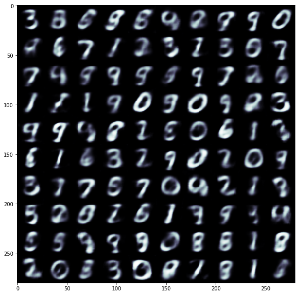
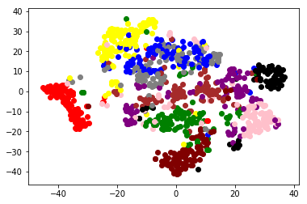

<h1> Variational Autoencoders </h1>
This is an implementation of Variational Autoencoders in pytorch. You can train and run it on both CPU as well as GPU :smile:

To test it just run all the cells sequentially and training will take place. After that you can test the model by passing in random values from the normal distribution and hence seeing what kind of different digits it displays everytime.

<h2> Basics of Autoencoders and VAEs </h2>

VAEs are one of the many varients of a an architecture known as autoencoders. Now the basic aim of any autoencoder is to represent an input image in a lower dimensional state, and then reconstruction from that state. So rather than having any label as the output, the input image itself is the output of the network. The lower dimensional state is highly useful in the sense that we have constrained our network so that our network is basically forced so as to represent the input image in that lower dimension which leads to the persistence of information which is of importance to the basic architecture of the image. So in a sense, we have created an image compression algo as such which can easily be decompressed using our decoder network. However this compression is, of course, lossy in nature and may lead to loss certain important details and hence not used for compression, practically.
 

<i>Basic workflow of VAE</i>

So what's so different about Variational Autoencoders? Well, first being that it is a generative model(and everyone loves the sound of that :wink:). So to do this we first must understand what was stopping the normal autoencoders to have this ability in the first place. So the basic aim of a simple autoencoder is just to learn an encoding and decoding mapping with no constraints or check on what the latent state may be. But in the case of VAE, the model also learns the parameter of the probability distribution representing the data. So when we want to generate new points, we can just sample random points from the distribution and feed it into our decoder network where the random points will acts as the latent variables for the model.

However when we are practically implementing the model, we predefine a distribution from which we can easily sample out and hence train the model accordingly.

<h2>Some tips for better results</h2>
Okay, so these are some of the tips and tricks which I thought were useful when I was implementing the model. I will keep on updating this list as I update my model. Hope these can be useful to others too.
<ol>
  <li>Use Batch Normalization in the encoder and decoder part of the model.</li>
  <li>For downsampling in the encoder network use MaxPool.</li>
  <li>For upsampling in the decoder network use ConvTranspose.</li>
  <li>Refrain from using Dropout in the decoder network.</li>
  <li>Scale down both the losses(BCEloss and KLDiv loss by the same factor).</li>
</ol>

<h2>Results</h2>
These were the images created by the network after 26 epochs:

<b>As we can clealy see that there is still a lot of scope for improvement</b>

 
This is the scatter plot obtained by employing t-SNE on the latent state variables obtained after training the model, with every  different color representing a latent state variables that represent different digits:

<b>So we can see the demarcation between cluster of points representing different digits, which should have been the case. Yayyy!!!</b>

<h2>References</h2>
<ol>
  <li>Tutorial Blog by Jaan Altosaar. <a href='https://jaan.io/what-is-variational-autoencoder-vae-tutorial/'>Link</a></li>
  <li>For the mathematical knowledge, this beautiful paper. <a href='https://arxiv.org/abs/1312.6114'>Link</a>
</ol>
